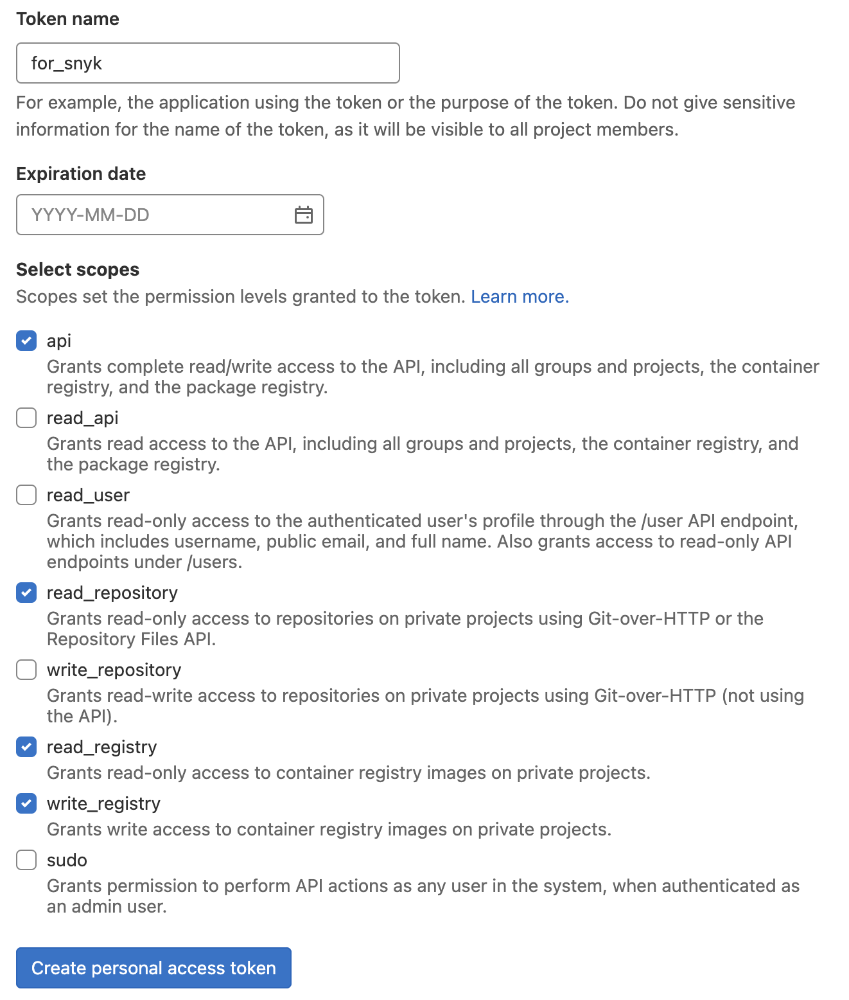

# Broker demo for locall gitlab instance

This demo locally runs GitLab container, create Snyk brokers to allow scanning by Snyk.

This demo sets up locally running GitLab instance as docker container. 

This demo also sets up Snyk brokers for OSS scan and container scan.
	
* For OSS scan
	* 1 broker

* For Container scan
	* 1 broker
	* 1 container registry agent

* For Code scan
	* 1 code agent

Snyk broker proxies the connection between local GitLab and Snyk platform.
Container registry agent interacts with GitLab container registy.

At end of demo, you will have following containers:

```console
$ docker  ps
CONTAINER ID   IMAGE                                  COMMAND                  CREATED         STATUS                 PORTS                                                                      NAMES
88b7687cc2da   snyk/code-agent                        "docker-entrypoint.s…"   2 minutes ago   Up 2 minutes           0.0.0.0:3000->3000/tcp                                                     code_agent
a0b57b019bb9   snyk/container-registry-agent:latest   "docker-entrypoint.s…"   7 minutes ago   Up 7 minutes           0.0.0.0:8081->8081/tcp, 17500/tcp                                          cra
13fea80cd417   snyk/broker:container-registry-agent   "/home/node/docker-e…"   7 minutes ago   Up 7 minutes           0.0.0.0:8001->8001/tcp                                                     cr_broker
774ac09687f0   snyk/broker:gitlab                     "broker --verbose"       8 minutes ago   Up 7 minutes           0.0.0.0:8000->8000/tcp                                                     broker
22fbcc87fa90   yrzr/gitlab-ce-arm64v8                 "/assets/wrapper"        3 hours ago     Up 3 hours (healthy)   0.0.0.0:80->80/tcp, 0.0.0.0:443->443/tcp, 22/tcp, 0.0.0.0:5555->5555/tcp   gitlab
```


## 0. Prerequisite

You need local DNS server (or /etc/hosts) and CA for issuing locally trusted certificate for HTTPS.

### Docker network

Create docker network.
```
docker network create mySnykBrokerNetwork
 ```

### Local DNS server

Host name resolution could be done by ediding /etc/hosts, but it always nice to have your own local DNS server ;-)
Below is example to resolve `*.test` as a local loopback address.

```bash
brew install dnsmasq

# set *.test domain as a local loopback address
echo 'address=/.test/127.0.0.1' >> $(brew --prefix)/etc/dnsmasq.conf

# Make dnsmasq as local DNS for *.test domain
sudo mkdir -v /etc/resolver
sudo bash -c 'echo "nameserver 127.0.0.1" >> /etc/resolver/test'

# Start dnsmasq
sudo brew services start dnsmasq
```

To test if DNS is working, try:
```console
ping snyk.test
ping gitlab.test
```

It should route to localhost.

### Local CA

You need locally trusted TLS cert for GitLab server.

```bash
brew install mkcert
mkcert -install # Set up local CA and generate CA cert 
mkcert <hostname> # Generated signed cert for hostname, IP, wildcard, etc
```

If you want to issue a cert for multiple SANS, try:
```
mkcert gitlab.test localhost 127.0.0.1
```

## 1. Set up GitLab locally

First, clone this repo.

```
git clone https://github.com/masa-snyk/broker_gitlab_local.git
```

Now, fire up GitLab.
For the first time to create GitLab container, it takes ~10 minutes (Download the image, Initializing the DB, etc).
After initial boot up is done, 

For this demo, the hostname of GitLab is `gitlab.test`. You can freely change the name, but make sure you also changes the hostnane in scripts.

***Note***: **For some reason, officail GitLab image (`gitlab/gitlab-ee:latest`) didn't work with my M1 Mac, so I used GitLab image built for M1 specifically (`yrzr/gitlab-ce-arm64v8`).**

***Note***: If you use MacOS Montrey, Airplay uses port 5000 which is default port for GitLab Container Registry... So need to portforward to something like 5555...

Run following or execute `1.create_containers.sh`.

```bash
#!/bin/bash

set -x

### ==========================
### Config
### ==========================

DOCKER_NETWORK=mySnykBrokerNetwork

GITLAB_CONTAINER_NAME=gitlab
GITLAB_HOME=${PWD}/volume
GITLAB_HOST=gitlab.test
# here's little hack. Mack OS uses port 5000 for Air-play (which is the default GitLab registry's port.
GITLAB_REGISTRY_PORT=5555

### ==========================
### Preparation
### ==========================

SSL_PATH=${GITLAB_HOME}/config/ssl

mkdir -p ${SSL_PATH}
chmod 755 ${SSL_PATH}

# Get root CA certificate
cp "$(mkcert -CAROOT)/rootCA.pem" ${SSL_PATH}/rootCA.pem

# Generate certs for GitLab instance
mkcert \
	-cert-file ${SSL_PATH}/${GITLAB_HOST}.crt \
	-key-file ${SSL_PATH}/${GITLAB_HOST}.key \
	${GITLAB_HOST}

### ===========================
### Create container for GitLab
### ===========================

mkdir -p ${GITLAB_HOME}

docker run -d \
	--restart always \
	--name ${GITLAB_CONTAINER_NAME} \
	--hostname ${GITLAB_HOST} \
	--network ${DOCKER_NETWORK} \
	-p 443:443 \
	-p 80:80 \
	-p ${GITLAB_REGISTRY_PORT}:${GITLAB_REGISTRY_PORT} \
	-v ${GITLAB_HOME}/config:/etc/gitlab \
	-v ${GITLAB_HOME}/logs:/var/log/gitlab \
	-v ${GITLAB_HOME}/data:/var/opt/gitlab \
	-e GITLAB_OMNIBUS_CONFIG="external_url 'https://${GITLAB_HOST}'; letsencrypt['enabled'] = false; registry_external_url 'https://${GITLAB_HOST}:${GITLAB_REGISTRY_PORT}'; nginx['redirect_http_to_https'] = true; registry_nginx['redirect_http_to_https'] = true" \
	yrzr/gitlab-ce-arm64v8
```

You can see the progress of installation/set up by:

```
docker logs -f gitlab
```

***Note***: For the first time you create GitLab container, it will also initialise databases and various sub-systems So takes time... (~10min)

## 2. Obtain initial root password

Once GitLab is up, you can retrieve initial root password.
```
docker exec -it gitlab grep 'Password:' /etc/gitlab/initial_root_password
```

Log in to GitLab with `root` as username and the password obtained by previous step:

```
open https://gitlab.test
```

Then create an access token. 
Creating non-root user is optional.

## 3. Create access token

Once you login, go to user menu on upper right corner.

Then go to "Access Tokens". 


You need 4 scopes:
* api - For Broker integration
* read_repositoy - For Code agent to read your repo
* read_registry - For Container scan
* write_registry - For this demo only (Not necessary for scan)

Then, preference -> Access Token -> Generate new like below:



Copy the token and save it in `gitlab_token` like below:

```
echo Kh4FSXXXXXhcQsYsCAFy > gitlab_token
```

## 4. Fire up Broker with access token & broker token

You need Broker token for broker to interact with Snyk platform.

* Broker token (To auth Broker <-> Snyk Platform)
	* [Generate credentials for Snyk Broker](https://docs.snyk.io/features/snyk-broker/set-up-snyk-broker/prepare-snyk-broker-for-deployment#generate-credentials-in-the-target-application-for-snyk-broker)

	* you can get broker token from Snyk UI integration page

		

	* Copy the token and save it in `broker_token` like below:

		```
		echo 350a39e2-3e4a-491a-a7ff-eb51ca9e2442 > broker_token
		```

Run the `2.create_broker.sh`.

Below is the conteints of `2.create_broker.sh`.

```
#!/bin/bash

set -x

### =======================
### Config
### =======================

DOCKER_NETWORK=mySnykBrokerNetwork

GITLAB_HOST=gitlab.test  # this name needs to be in SANS of cert. cert name must be the same.
GITLAB_TOKEN=$(cat gitlab_token) # Replace this with actual Gitlab token

BROKER_TOKEN=$(cat broker_token) # Replace this with actual Broker token
BROKER_CONTAINER_NAME=broker
BROKER_PUBLISH_PORT=8000

### =======================
### Preparation
### =======================

BROKER_HOST=$(ifconfig en0 | awk '$1 == "inet" {print $2}')
BROKER_URL=http://${BROKER_HOST}:${BROKER_PUBLISH_PORT}
ACCEPT_JSON_PATH=${PWD}

### ==========================
### Create container for Broker
### =======================

docker run -d \
	--restart=always \
	--name ${BROKER_CONTAINER_NAME} \
	--hostname ${BROKER_CONTAINER_NAME} \
	--network ${DOCKER_NETWORK} \
	-p ${BROKER_PUBLISH_PORT}:${BROKER_PUBLISH_PORT} \
	-v ${ACCEPT_JSON_PATH}:/private \
	-e BROKER_TOKEN=${BROKER_TOKEN} \
	-e GITLAB_TOKEN=${GITLAB_TOKEN} \
	-e GITLAB=${GITLAB_HOST} \
	-e PORT=${BROKER_PUBLISH_PORT} \
	-e BROKER_CLIENT_URL=${BROKER_URL} \
	-e ACCEPT=/private/accept.json \
	-e NODE_TLS_REJECT_UNAUTHORIZED=0 \
	snyk/broker:gitlab
```

Once broker fires up, you should be able to retrieve local GitLab repositories from Snyk UI.


## 5. Fire up Broker and Container registry agent for Container scan

Now, we are going to fire up broker and container registry agent (CRA) for container scan.

You need another broker token for Gitlab containter integration.
You can git the token from Snyk UI integration page.


* Copy the token and save it in `cr_broker_token` like below:

```
echo Kh4FXXXXXhcQsYsCAFy > cr_broker_token
```

Run the `3.create_cra.sh`.

This scripts will create a sample docker image and push to Gitlab container registry.
Then creates 2 containers (Broker and CRA).

Below is the contents of `3.create_cra.sh`.

```
#!/bin/bash

set -x

### =================================
### Config
### =================================

DOCKER_NETWORK=mySnykBrokerNetwork

GITLAB_HOST=gitlab.test
GITLAB_USER=root
GITLAB_TOKEN=$(cat gitlab_token)
GITLAB_CONTAINER_REPO=monitoring
GITLAB_REGISTRY_PORT=5555
TAG=latest
BROKER_TOKEN=$(cat cr_broker_token)
BROKER_PUBLISH_PORT=8001
BROKER_CONTAINER_NAME=cr_broker

CRA_CONTAINER_NAME=cra
CRA_AGENT_PORT=8081

### =================================
### Preparation
### =================================

GITLAB_PASSWORD=$(docker exec -it gitlab grep 'Password:' /etc/gitlab/initial_root_password | cut -s -w -f 2 | tr -d '\r')
GITLAB_REGISTRY_HOST=${GITLAB_HOST}:${GITLAB_REGISTRY_PORT}
GROUP_ID=$(curl -s --header "Authorization: Bearer ${GITLAB_TOKEN}" -X GET "https://${GITLAB_HOST}/api/v4/groups" | jq -r '.[0].path')

BROKER_HOST=$(ifconfig en0 | awk '$1 == "inet" {print $2}')
BROKER_URL=http://${BROKER_HOST}:${BROKER_PUBLISH_PORT}

CR_AGENT_URL=http://$(ifconfig en0 | awk '$1 == "inet" {print $2}'):${CRA_AGENT_PORT}
CR_TYPE=gitlab-cr
CR_BASE=${GITLAB_HOST}:${GITLAB_REGISTRY_PORT}
CR_USERNAME=${GITLAB_USER}
CR_PASSWORD=${GITLAB_PASSWORD}

#CA_PATH=${PWD}/volume/config/ssl
#CA_CERT=rootCA.pem

### =================================
### Docker build
###  - this will push to default repo
### =================================

echo ${GITLAB_PASSWORD} | docker login -u ${GITLAB_USER} --password-stdin ${GITLAB_REGISTRY_HOST}
docker build -t ${GITLAB_REGISTRY_HOST}/${GROUP_ID}/${GITLAB_CONTAINER_REPO}:${TAG} .
docker push ${GITLAB_REGISTRY_HOST}/${GROUP_ID}/${GITLAB_CONTAINER_REPO}:${TAG}

### =================================
### Run Broker client for container registry
### =================================

docker run -d \
	--restart=always \
	--name ${BROKER_CONTAINER_NAME} \
	--hostname ${BROKER_CONTAINER_NAME} \
	--network ${DOCKER_NETWORK} \
	-p ${BROKER_PUBLISH_PORT}:${BROKER_PUBLISH_PORT} \
	-e BROKER_TOKEN=${BROKER_TOKEN} \
	-e BROKER_CLIENT_URL=${BROKER_URL} \
	-e CR_AGENT_URL=${CR_AGENT_URL} \
	-e CR_TYPE=${CR_TYPE} \
	-e CR_BASE=${CR_BASE} \
	-e CR_USERNAME=${CR_USERNAME} \
	-e CR_PASSWORD=${CR_PASSWORD} \
	-e BROKER_CLIENT_VALIDATION_URL=${CR_AGENT_URL}/systemcheck \
	-e PORT=${BROKER_PUBLISH_PORT} \
	-e NODE_TLS_REJECT_UNAUTHORIZED=0 \
	snyk/broker:container-registry-agent

### =================================
### Run Container Registry Agent
### =================================

docker run -d \
	--restart=always \
	--name ${CRA_CONTAINER_NAME} \
	--hostname ${CRA_CONTAINER_NAME} \
	--network ${DOCKER_NETWORK} \
	-p ${CRA_AGENT_PORT}:${CRA_AGENT_PORT} \
	-e SNYK_PORT=${CRA_AGENT_PORT} \
	-e NODE_TLS_REJECT_UNAUTHORIZED=0 \
	snyk/container-registry-agent:latest

```

Once broker and CRA are up, you should be able to retrieve container images from Snyk UI.


## 6. Fire up Code Agent

Now, we are going to run code agent for code scan.

**NOTE: Before you start this step, make sure you contacted Snyk's SE or support to enable the snykCodeAccess feature enabled!**

You need Snyk API Token for this.
You can get it from "Account settings" in Snyk UI.


* Copy the token and save it in `snyk_api_token` like below:

```
echo eabdc0e8-xxxx-xxxx-xxxx-2a0ffbf936ec > snyk_api_token
```

Run the `4.create_code_agent.sh`.

This scripts will create code agent container. 

Below is the contents of `4.create_code_agent.sh`.

```
#!/bin/bash

set -x

### =================================
### Config
### =================================

DOCKER_NETWORK=mySnykBrokerNetwork

GITLAB_HOST=gitlab.test
GITLAB_TOKEN=$(cat gitlab_token)
SNYK_TOKEN=$(cat snyk_api_token)

CODE_AGENT_CONTAINER_NAME=code_agent
CODE_AGENT_PORT=3000

### =================================
### Preparation
### =================================

GROUP_ID=$(curl -s --header "Authorization: Bearer ${GITLAB_TOKEN}" -X GET "https://${GITLAB_HOST}/api/v4/groups" | jq -r '.[0].path')

### =================================
### Push sample code
###  - this will push to default repo
### =================================

pushd goof

git init --initial-branch=main
git remote add origin https://${GITLAB_HOST}/${GROUP_ID}/Monitoring.git
git add .
git commit -m "Initial commit"
git push -u origin main

popd

### =================================
### Run Code Agent
### =================================

docker run -d \
	--restart=always \
	--name ${CODE_AGENT_CONTAINER_NAME} \
	--hostname ${CODE_AGENT_CONTAINER_NAME} \
	--network ${DOCKER_NETWORK} \
	-p ${CODE_AGENT_PORT}:${CODE_AGENT_PORT} \
	-e SNYK_TOKEN=${SNYK_TOKEN} \
	-e PORT=${CODE_AGENT_PORT} \
	-e NODE_TLS_REJECT_UNAUTHORIZED=0 \
	snyk/code-agent
```

Once code broker is up, you should be able to scan the code from re-importing your repository.


**That's it!**


----

## Additional topics

---

### Issue new TLS cert and apply

You can issue new TLS cert by:
```
mkcert \
	-cert-file volume/config/ssl/gitlab.test.crt \
	-key-file volume/config/ssl/gitlab.test.key \
	gitlab.test
```

Run following to restart Nginx to take new TLS certs.
```
docker exec -u root gitlab gitlab-ctl hup nginx registry
```

Then access local gitlab UI from your browser, and you should see the HTTPS connection with new cert.
```
open https://masa.gitlab.test
```

### Apply new GitLab configuration

If you modify GitLab config (suchas enabling container registy), run following to restart GitLab to take new configuration.
```
docker exec -u root gitlab gitlab-ctl reconfigure
```

## References

* Configure HTTPS
	* [https://docs.gitlab.com/omnibus/settings/nginx.html#manually-configuring-https](https://docs.gitlab.com/omnibus/settings/nginx.html#manually-configuring-https)


## ToDos

* [x][2022/08/02] Broker for Container registry and agent
* [x][2022/08/02] Code agent
* [] Try not to use `-e NODE_TLS_REJECT_UNAUTHORIZED=0` option for snyk containers...
